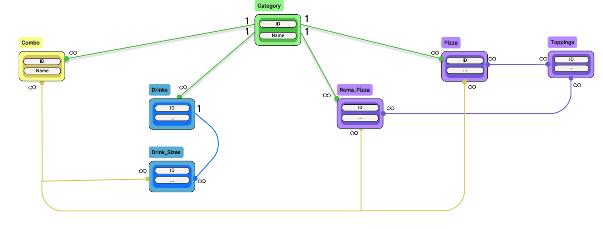
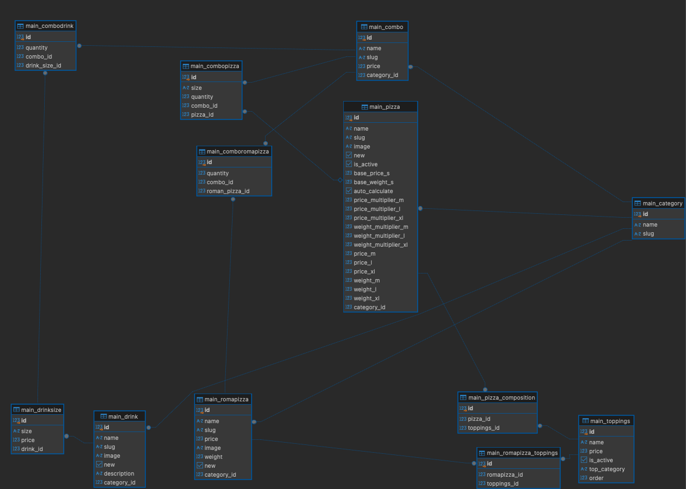

# Database
Продуктовая база данных представляет из себя следующую схему (без пользователей и карзин)

Есть 5 сущностей (в админки название категорий прописывается вручную, это не совсем удобно, но изначально была идея сделать одну модель продукта и настраивать её, но это слишком сложно и неэффективно, поэтому ручной выбор категории пока что остается): Пицца, Римская пицца, Напитки, Топпинги (для создания пицц) и Комбо (объединяют в себя различные позиции). Стрелками с подписями (1 и ∞) указаны отношения "один ко многим" и "многие ко многим", промежуточные таблицы указаны ниже.

Для напитков была сделана отдельная таблица, так как у напитка вариативность в размерах (объемах), у пиццы всегда 3 размера.
